# AI Exercise Substitution Flow

This document describes how the AI suggests alternative exercises when users need to swap an exercise.

## Overview

Users may need to substitute exercises due to equipment unavailability, injury, preference, or variety. The AI provides intelligent alternatives that maintain training effectiveness.

## Flow Diagram


## Substitution Logic


## Substitution Graph


## AI Context Building


## Request Structure


## Similarity Scoring


## Injury-Aware Substitution

```mermaid
flowchart TD
    A[User Reports Pain] --> B{Pain Location}
    
    B -->|Shoulder| C[Avoid Overhead Movements]
    B -->|Lower Back| D[Avoid Spinal Loading]
    B -->|Knee| E[Avoid Deep Flexion]
    B -->|Wrist| F[Avoid Gripping Stress]
    
    C --> G[Filter Alternatives]
    D --> G
    E --> G
    F --> G
    
    G --> H[Safe Alternatives Only]
    
    subgraph Examples["Example Substitutions"]
        C --> C1[OHP → Landmine Press]
        D --> D1[Deadlift → Hip Thrust]
        E --> E1[Squat → Leg Press (limited ROM)]
        F --> F1[Barbell Curl → Cable Curl]
    end
```

## User Selection Flow


## Equipment-Based Filtering

```mermaid
flowchart TD
    subgraph Available["User's Equipment"]
        E1[✓ Barbell]
        E2[✓ Dumbbells]
        E3[✗ Cables]
        E4[✓ Bench]
        E5[✗ Machines]
    end

    subgraph Original["Original Exercise"]
        O[Cable Flyes<br/>Requires: Cables]
    end

    subgraph Filtered["Filtered Alternatives"]
        F1[Dumbbell Flyes ✓]
        F2[Push-ups ✓]
        F3[Dumbbell Bench ✓]
        F4[Machine Flyes ✗]
        F5[Pec Deck ✗]
    end

    Available --> Filtered
    Original --> Filtered
```


