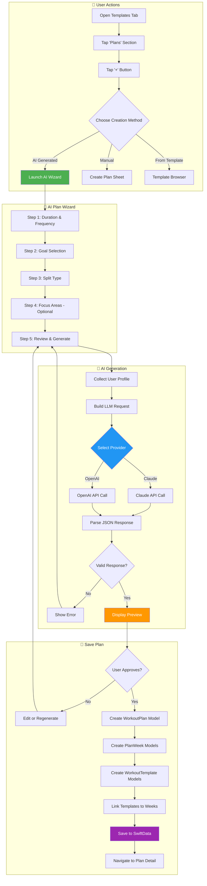
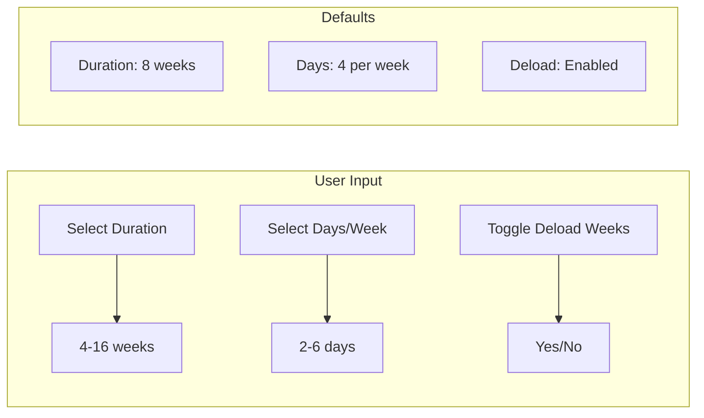
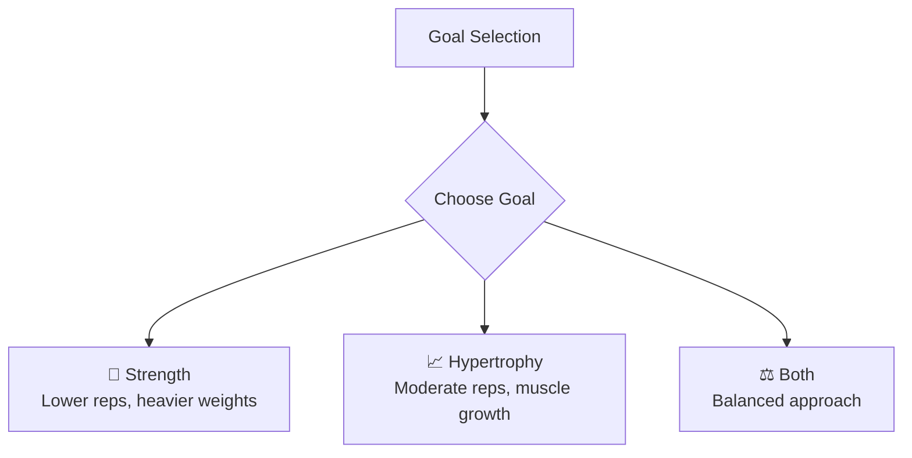
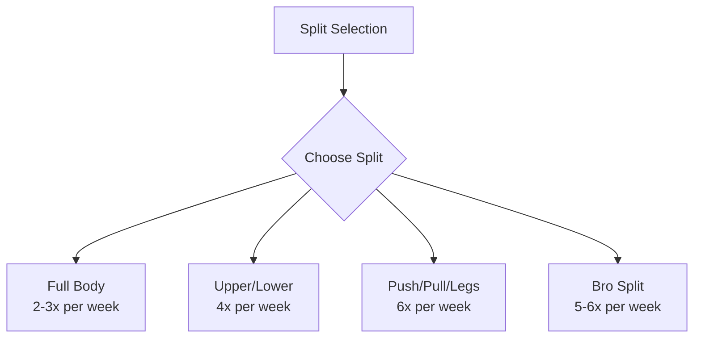
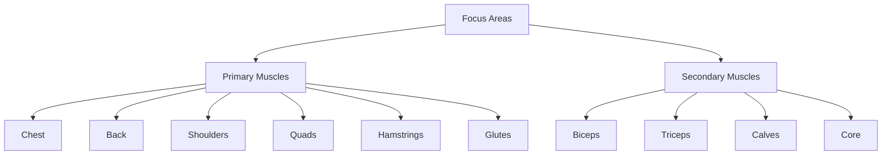
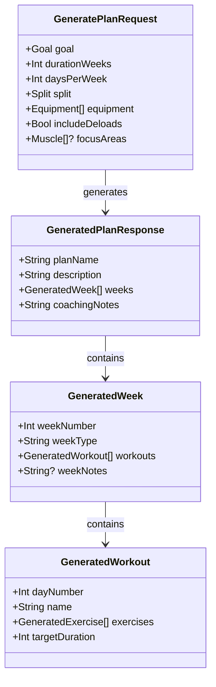
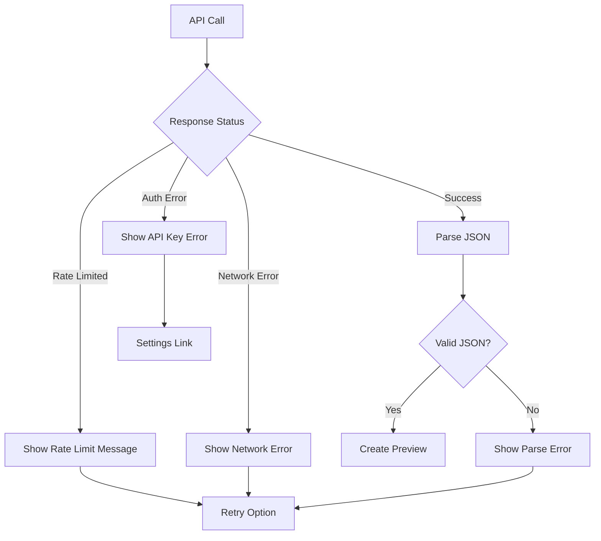
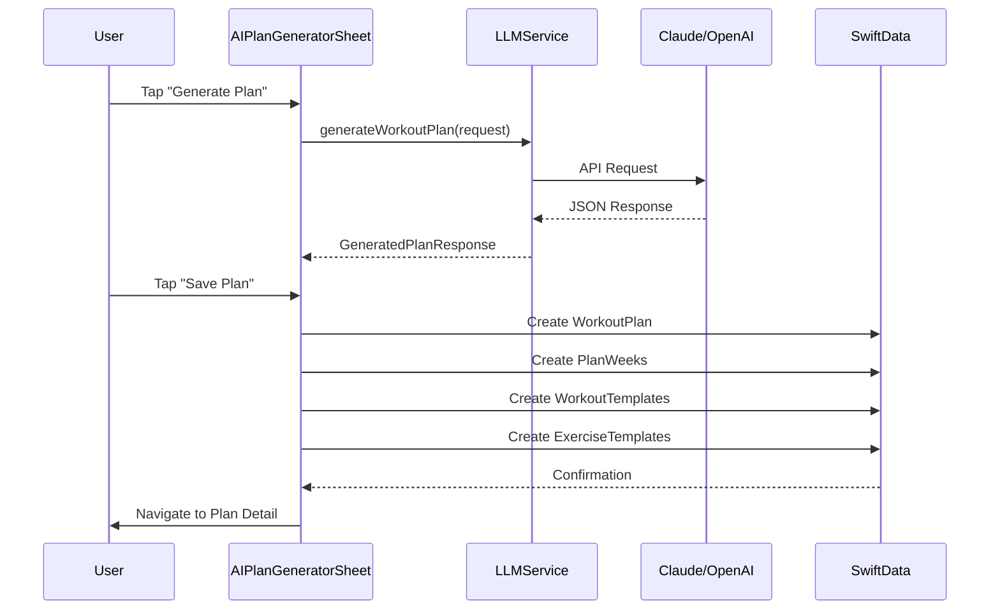

# AI Workout Plan Generation Flow

This document describes the complete user flow for generating workout plans using AI.

## Overview

The AI Plan Generator is a 5-step wizard that collects user preferences and generates a personalized multi-week workout program.

## Flow Diagram

## Step Details

### Step 1: Duration & Frequency

### Step 2: Goal Selection

### Step 3: Split Selection

### Step 4: Focus Areas (Optional)

## LLM Request Structure

## Error Handling

## Data Model Creation

