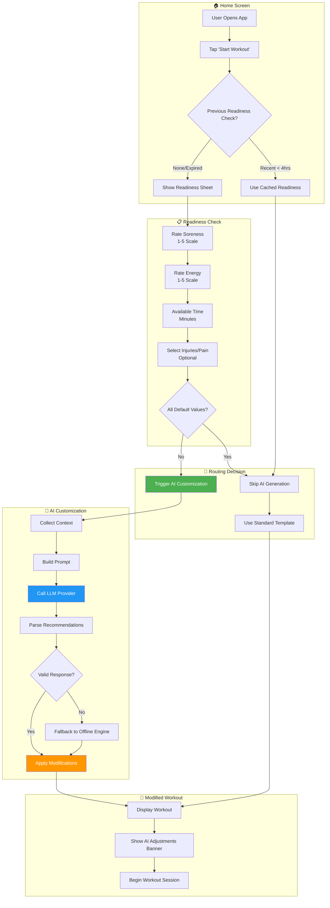
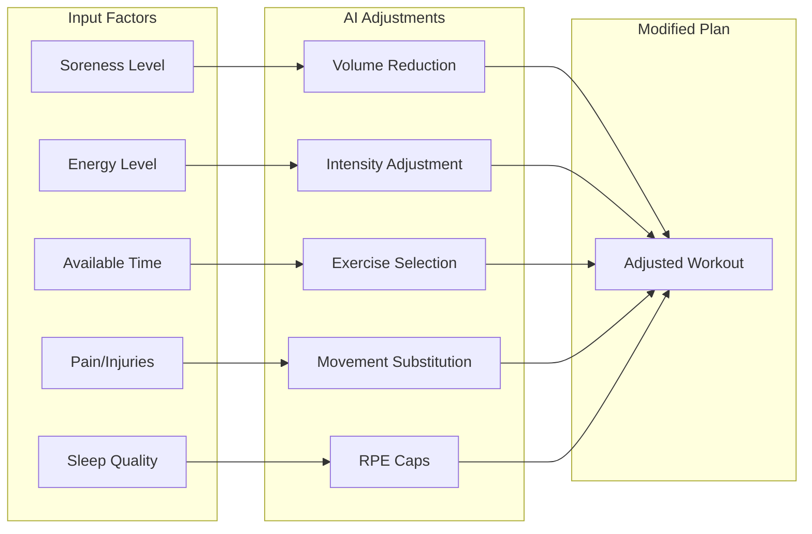
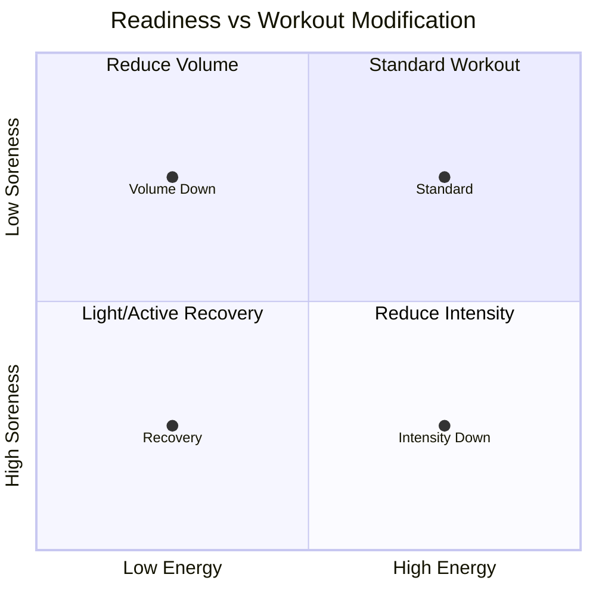
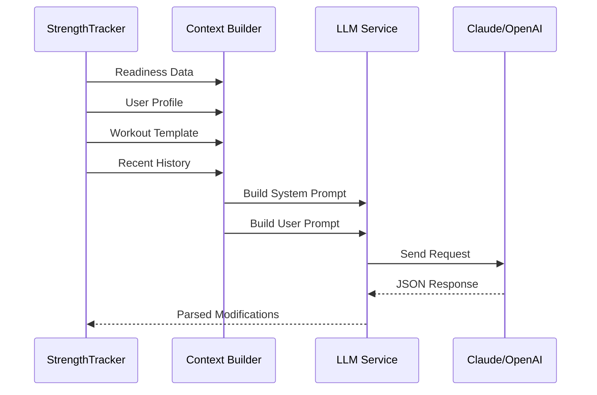
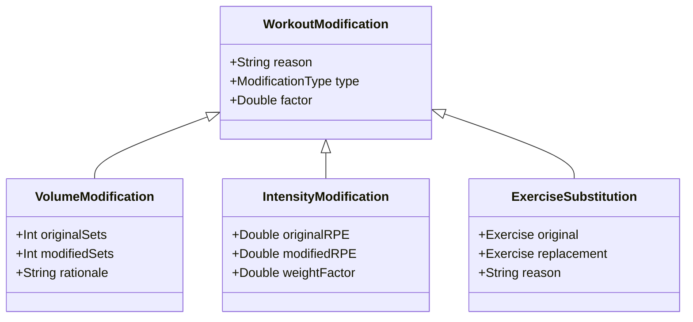
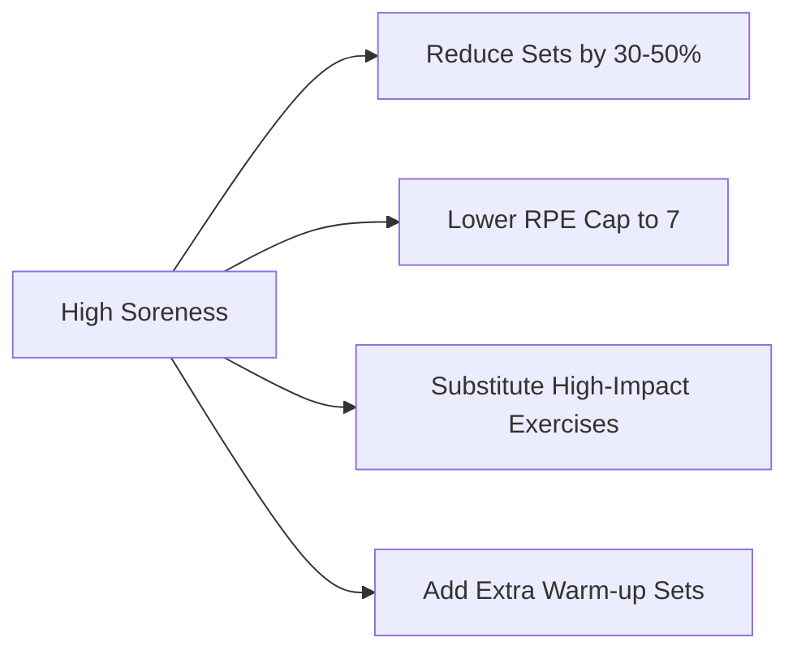
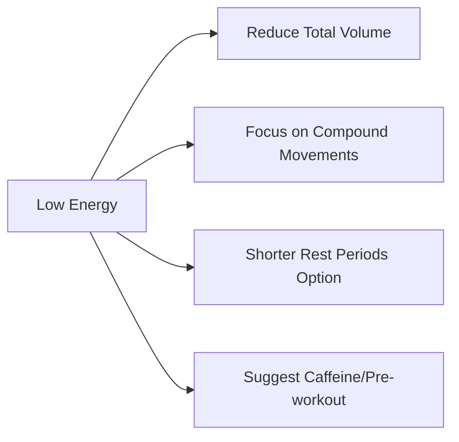
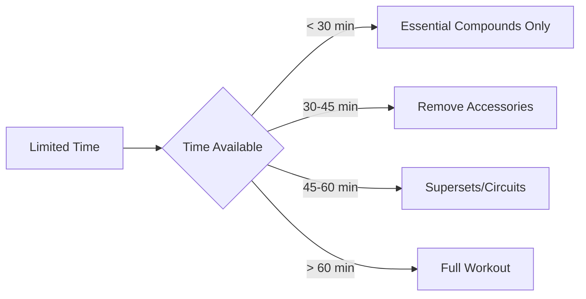
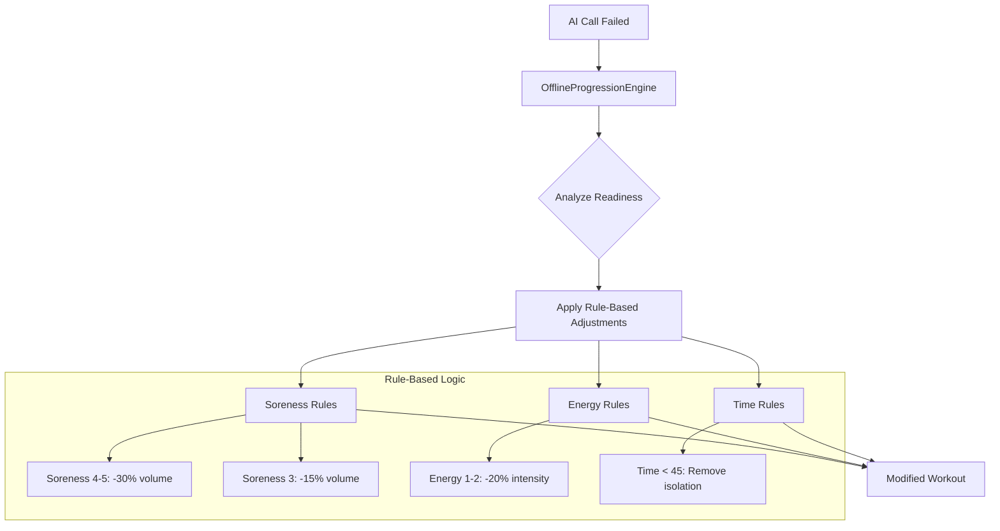
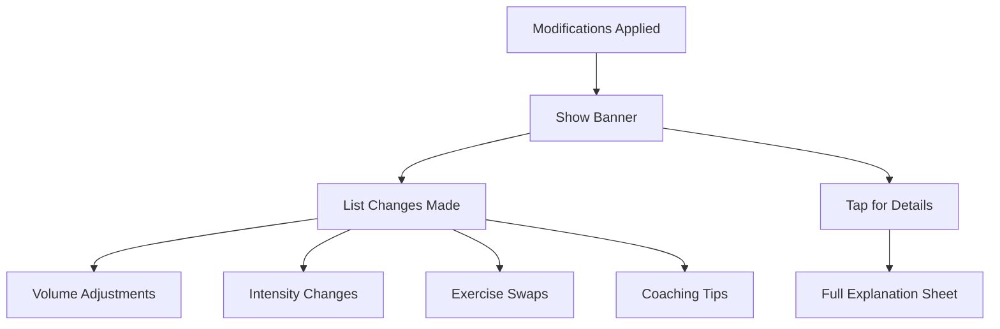

# AI Workout Customization Flow

This document describes how the AI customizes workouts based on user's daily readiness check.

## Overview

Before starting a workout, users complete a readiness check. The AI uses this information to adjust the workout plan for optimal results and injury prevention.

## Flow Diagram

## Readiness Factors

## Modification Matrix

## AI Prompt Construction

## Modification Types

## Example Adjustments

### High Soreness (4-5)

### Low Energy (1-2)

### Time Constraint

## Offline Fallback

## User Notification

