# Plan Progression Flow

This document describes how workout plans progress through weeks and track completion.

## Overview

StrengthTracker automatically manages plan progression, advancing users through weeks as they complete workouts, and handling deload/peak weeks appropriately.

## Main Flow Diagram

## Week Type Handling

## State Machine

## Progress Calculation

## Weekly Transition

```mermaid
sequenceDiagram
    participant User
    participant Session as WorkoutSession
    participant Plan as WorkoutPlan
    participant Week as PlanWeek
    participant Service as PlanProgressService

    User->>Session: Complete Workout
    Session->>Plan: recordCompletedWorkout()
    Plan->>Plan: completedWorkoutsThisWeek++
    
    Plan->>Plan: advanceWeekIfNeeded()
    
    alt Workouts Complete
        Plan->>Week: isCompleted = true
        Plan->>Plan: currentWeek++
        Plan->>Plan: completedWorkoutsThisWeek = 0
        Plan-->>User: Show "Week Complete" 🎉
    else Workouts Remaining
        Plan-->>User: Show Progress Update
    end
    
    Note over Plan: Check if final week
    
    alt Plan Complete
        Plan->>Plan: isActive = false
        Plan-->>User: Show "Plan Complete" 🏆
    end
```

## Plan Lifecycle

## UI State Updates

## Edge Cases

## Analytics Events

