# Workout Execution Flow

This document describes the complete flow of executing a workout from start to finish.

## Overview

A workout session involves selecting/starting a workout, completing exercises with sets, and finishing with a summary. AI assists with readiness adjustments and progression recommendations.

## Complete Flow Diagram

```mermaid
flowchart TD
    subgraph Selection["🏠 Workout Selection"]
        A[Open App] --> B{Active Plan?}
        B -->|Yes| C[Show Plan's Current Week]
        B -->|No| D[Show All Templates]
        
        C --> E[Select Workout]
        D --> E
        E --> F[Tap 'Start Workout']
    end

    subgraph Readiness["📋 Readiness Check"]
        F --> G{Check Recent Readiness}
        G -->|Fresh| H[Use Existing]
        G -->|Stale/None| I[Show Readiness Sheet]
        
        I --> J[Complete Check]
        J --> K{Non-Default Values?}
        K -->|Yes| L[🤖 AI Customization]
        K -->|No| M[Use Standard Plan]
        
        H --> M
        L --> M
    end

    subgraph Session["💪 Workout Session"]
        M --> N[Create WorkoutSession]
        N --> O[Show First Exercise]
        
        O --> P[Log Set]
        P --> Q{More Sets?}
        Q -->|Yes| R[Rest Timer]
        R --> P
        Q -->|No| S{More Exercises?}
        S -->|Yes| T[Next Exercise]
        T --> P
        S -->|No| U[Finish Workout]
    end

    subgraph Completion["✅ Completion"]
        U --> V[Calculate Stats]
        V --> W[Show Summary]
        W --> X[🤖 AI Feedback]
        X --> Y{Plan Active?}
        Y -->|Yes| Z[Update Plan Progress]
        Y -->|No| AA[Save Session]
        Z --> AA
        AA --> AB[Return Home]
    end

    style L fill:#4CAF50,color:white
    style X fill:#4CAF50,color:white
    style Z fill:#2196F3,color:white
```

## Exercise Logging Detail

## Rest Timer Flow

## Progression System

```mermaid
flowchart TD
    subgraph Analysis["Set Analysis"]
        A[Log Final Set]
        A --> B[Compare to Target]
        B --> C{Met Target?}
    end

    subgraph Success["Target Met"]
        C -->|Yes| D{Exceeded?}
        D -->|Yes| E[🤖 Suggest Weight Increase]
        D -->|No| F[Maintain Weight]
    end

    subgraph Failure["Target Missed"]
        C -->|No| G{How Much?}
        G -->|Slight Miss| H[Retry Next Session]
        G -->|Significant| I[🤖 Analyze Cause]
        I --> J[Suggest Deload?]
    end

    subgraph Progression["Progression Rules"]
        E --> K[+5 lbs Lower Body]
        E --> L[+2.5 lbs Upper Body]
        E --> M[+1 Rep Next Time]
    end
```

## Pause & Resume Flow

## Workout Summary

```mermaid
flowchart TD
    subgraph Stats["Session Statistics"]
        A[Total Duration]
        B[Sets Completed]
        C[Total Volume]
        D[Exercises Done]
        E[PRs Hit]
    end

    subgraph Analysis["🤖 AI Analysis"]
        F[Performance vs Target]
        G[Recovery Recommendations]
        H[Next Session Preview]
        I[Coaching Notes]
    end

    subgraph Actions["Post-Workout"]
        J[Save to History]
        K[Update PRs]
        L[Update Plan Progress]
        M[Share Option]
    end

    Stats --> Analysis
    Analysis --> Actions
```

## Data Flow

## Exercise Navigation

```mermaid
flowchart LR
    subgraph Navigation["Exercise Navigation"]
        A[Previous] --> B[Current Exercise]
        B --> C[Next]
        
        D[Exercise List] --> E[Jump to Any]
        E --> B
    end

    subgraph Status["Exercise Status"]
        F[⚪ Not Started]
        G[🟡 In Progress]
        H[🟢 Completed]
        I[⏭️ Skipped]
    end
```

## Error Handling

## Offline Capability

## Performance Tracking

